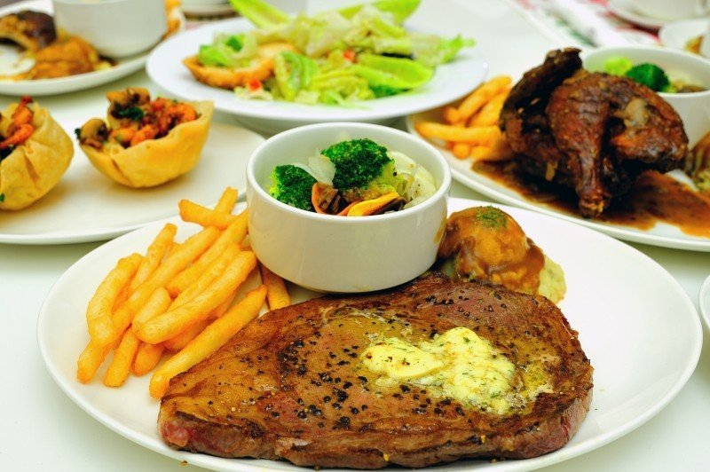

# 題目

- 請在水平線標籤下方將影像 v1.jpg~v3.jpg 連結至頁面中
  請利用 figure 標籤安排標註

# 作法

```html
<!DOCTYPE html>
<html lang="en">
  <head>
    <meta charset="UTF-8" />
    <title>HTML5-影像標註</title>
    <style>
      figure {
        float: left;
      }
      img {
        width: 300px;
      }
    </style>
  </head>
  <body>
    <h1>GOOD PHOTO</h1>
    <hr />
    <table>
      <tr>
        <td>
          
        </td>
        <td>
          
        </td>
        <td>
          
        </td>
      </tr>
      <tr>
        <td>稻田</td>
        <td>海洋</td>
        <td>美食</td>
      </tr>
    </table>
    <hr />

    <figure>
      
      <figcaption>稻田</figcaption>
    </figure>
    <figure>
      
      <figcaption>海洋</figcaption>
    </figure>
    <figure>
      
      <figcaption>美食</figcaption>
    </figure>

    <hr />

    <figure>
      
      <figcaption>稻田</figcaption>
      
      <figcaption>海洋</figcaption>
      
      <figcaption>美食</figcaption>
    </figure>
  </body>
</html>
```
