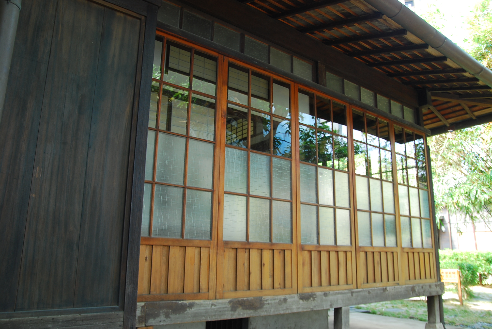

# 題目

- 部落格文章布局

# 作法

```html
<!DOCTYPE html>
<html lang="en">
  <head>
    <meta charset="UTF-8" />
    <meta name="viewport" content="width=device-width, initial-scale=1.0" />
    <title>Document</title>
    <style>
      body,
      * {
        margin: 0;
        font-size: 100%;
      }
      #wrapper {
        background-color: #99c;
      }
      #wrapper #banner {
        background-image: url('images/big.gif');
        background-position: center;
        background-size: cover;
        height: 500px;
      }
      #wrapper #intro p {
        letter-spacing: 1px;
        line-height: 26px;
        text-indent: 36px;
        text-align: justify;
        color: #fff;
        width: 95%;
        margin: 50px auto;
      }
      #wrapper #work {
        text-align: center;
      }
      #wrapper #work img {
        width: 30%;
        margin: 1.5%;
      }
      #wrapper #footer {
        height: 120px;
        background-color: #666;
      }
      #wrapper #footer p {
        text-align: center;
        color: #fff;
        letter-spacing: 2px;
        line-height: 120px;
      }
    </style>
  </head>
  <body>
    <div id="wrapper">
      <div id="banner"></div>
      <div id="intro">
        <p>
          Lorem ipsum dolor sit, amet consectetur adipisicing elit. Tenetur
          voluptatibus odio incidunt amet iste hic unde, labore, ducimus,
          architecto sint eos repudiandae voluptatem fugit alias illo expedita.
          Error soluta at quis enim cupiditate expedita deleniti sequi
          temporibus laboriosam officiis! Quae veritatis impedit, architecto
          officia aliquid repellendus distinctio! Aspernatur hic ipsa ratione
          ipsum mollitia. Ratione nostrum, fugiat ea quisquam dolorum quaerat
          enim ipsam molestiae esse sapiente dolorem neque molestias, doloribus,
          quod exercitationem? Quis esse eos officiis aperiam cumque vitae
          architecto accusamus molestias voluptates repudiandae, quam impedit
          facilis sunt quasi magni commodi nisi tempore. Voluptatibus deserunt,
          nisi quod molestias eius impedit maxime ab, voluptatem nemo repellat
          quam sequi dolore odit mollitia. Veniam corrupti, ipsam minima
          adipisci fugiat voluptatem nemo expedita porro veritatis vel fugit
          natus harum itaque cumque dignissimos quod sit deserunt aliquam sequi.
          Impedit harum sed ea, velit quod dolores beatae accusantium
          consequatur repellendus magni repudiandae adipisci, quidem nemo fuga
          dolorum atque distinctio? Consequuntur explicabo maiores nisi
          voluptatum beatae in eum asperiores molestias sed! Veritatis iure
          provident, laudantium commodi dicta, quidem similique recusandae
          nesciunt architecto voluptatibus odit quis sunt reprehenderit
          exercitationem atque omnis eligendi unde. Suscipit voluptatem ipsum
          exercitationem blanditiis quis minus adipisci nobis ducimus officiis
          unde consequatur harum, ipsa dignissimos?
        </p>
      </div>
      <div id="work">
        
        
        
      </div>
      <div id="footer">
        <p>BASIC WEB DESIGN</p>
      </div>
    </div>
  </body>
</html>
```
