<h1>目錄</h1>

[toc]

---

# Eclipse 安裝

- Eclipse

  - [下載企業版(Eclipse IDE for Enterprise Java Developers)](https://www.eclipse.org/downloads/packages/)
  - 執行後的 Workspace(工作區) 選擇自己的項目資料夾

<div style="text-align:center">
  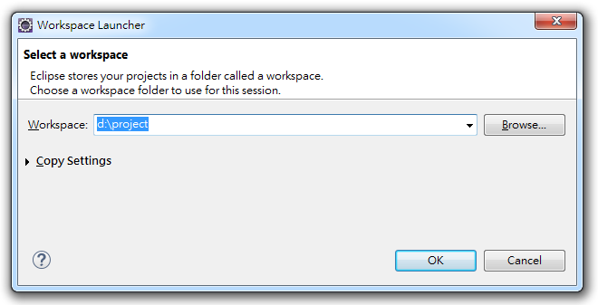
</div>

# Eclipse 修改所有文件預設編碼為 UTF-8

- `Window` > `Perferences` > `General` > `Workspace` > `Text file encoding` > `Other` > `UTF-8`

<div style="text-align:center">
  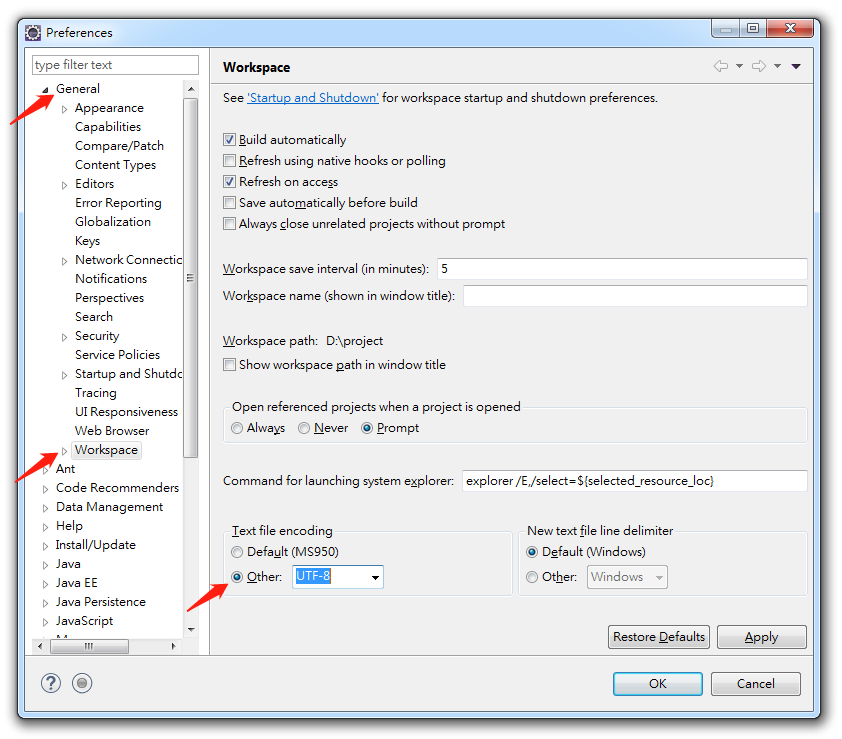
</div>

# Eclipse 導入壓縮項目

- `File` > `Import` > `Existing Projects into Workspace`

<div style="text-align:center">
  
</div>

- `Select archive file` 選擇需導入的項目 > 點選 `Finish`

<div style="text-align:center">
  
</div>

# Eclipse 導入的驚嘆號(！)問題

- 問題原因

  - 因為項目中無此 jar 包，故需更改

- 解決方法

  - `Build Path` > `Configure Build Path` > `Libraries` 標籤
  - 雙擊出現 `x` 符號的 `JRE System Library[Java SE...]`(JAR 包)
  - `Alternate JRE` > `Finish`

<div style="text-align:center">
  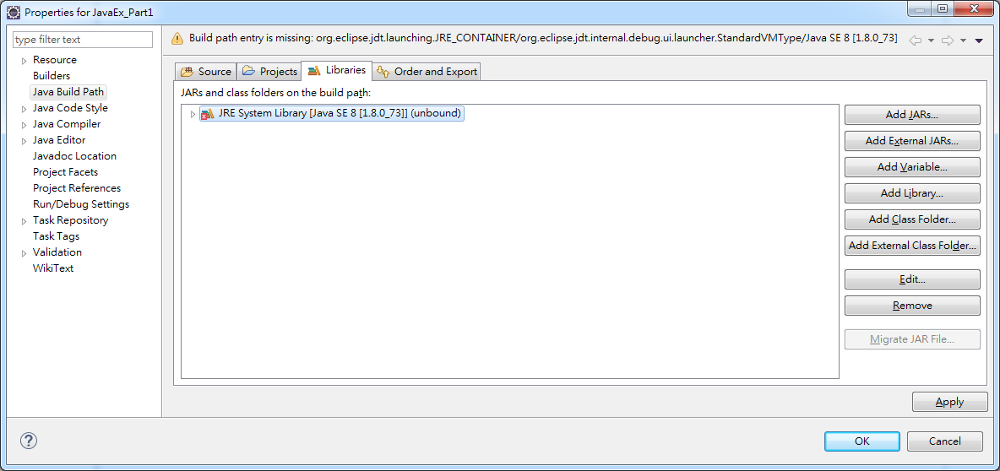
</div>

# Eclipse 導入後文件錯誤(X)問題

- 問題原因

  - 文字編碼不同，會導緻文字亂碼

- 解決方法

  - 照著 [Eclipse 修改所有文件預設編碼為 UTF-8](#eclipse-%E4%BF%AE%E6%94%B9%E6%89%80%E6%9C%89%E6%96%87%E4%BB%B6%E9%A0%90%E8%A8%AD%E7%B7%A8%E7%A2%BC%E7%82%BA-utf-8)步驟操作即可

<div style="text-align:center">
  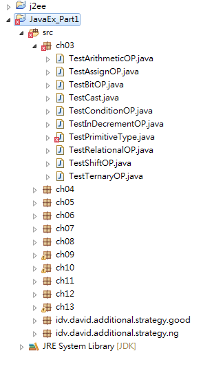
</div>

# Eclipse 快捷

- 一次註解

  ```cs
  Ctrl + /
  ```

# Eclipse 改變字體大小

- `Window` > `Perferences` > `General` > `Apperance` > `Colors and Fonts` > `Java` > `Java Editor Text Font` > `Change`

# Eclipse 中 package 錯誤

- 假設複製文件到新的 package 時應該注意 `package xxx;` 需要跟當下 `package name` 相同，否則會有錯誤産生

<div style="text-align:center">
  
</div>

# Eclipse 除錯(Debug)功能

- 設定中斷點

  ```cs
  Ctrl + Shift + B
  ```

- 執行 Debug

  ```cs
  F11
  ```

- 跳至下一行

  ```cs
  F6
  ```

  ***

  - `Debug TestWhile` > `switch` > `Step Over(F6)`

- 跳至下個中斷點

  ```cs
  F5
  ```

  ***

  - `Debug TestWhile` > `switch` > `Step Into(F5)`

- 關閉測試

  ```cs
  Ctrl + F2
  ```

  ***

  - `Run` > `Terminate(Ctrl + F2)`

- variables 視窗中 name 左方 `L` 字樣的小 icon 錶示區域變數

  <div style="text-align:center">
    
  </div>

# Eclipse Outline 功能

- 可用 Outline 方式跳到資料再程式碼中的執行位置(類似錨點)

  <div style="text-align:center">
    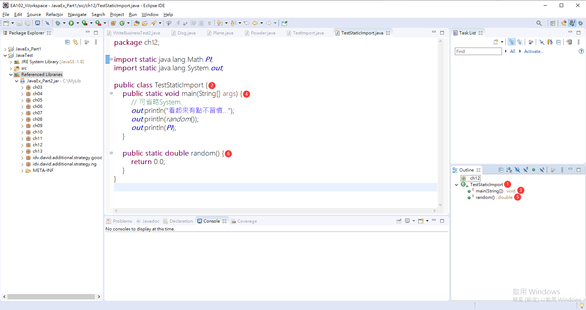
  </div>

# Eclipse 還原測試視窗

- `Window` > `Perspective` > `Reset Perspective...`

# Eclipse 保存代碼時自動格式化

- `windows` > `Preferences` > `Java` > `Editor` > `Save Actions`
- 勾選 `Perform the selected actions on save`

<div style="text-align:center">
  
</div>

# Eclipse 無法正常導入項目

- 錯誤提示

  - `Some projects cannot be imported because they already exist in the workspace；`

- 問題原因

  - workspace 中已經存在相同名稱的項目，所以不能導入
  - 項目資料已刪，但資料夾未在 workspace 中刪除

- 解決方法

  - 方法 1: 找到設定 workspace 項目時的地點，將該資料夾移除
  - 方法 2: 修改項目名：右擊 `refactor` > `rename` 或 `F2`
  - 方法 3: 打開項目中 `.project` 文件 > 修改 `<name>projectName</name>`

# Eclipse 創建介面(Interface)檔

<div style="text-align:center">
  
</div>

# Eclipse 匯出(Export) jar

- `file` (或在 Package Explore 區域右鍵) > `Export` > `JAR file`

  <div style="text-align:center">
    
  </div>

- 可指定選擇要製成 jar 的項目

  <div style="text-align:center">
    
  </div>

- `ok`

  <div style="text-align:center">
    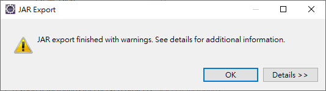
  </div>

- 匯出成功

  <div style="text-align:center">
    
  </div>

# Eclipse 引入類別函式庫(第三方或自己的)

- 創建自訂函式庫存放位置

  <div style="text-align:center">
    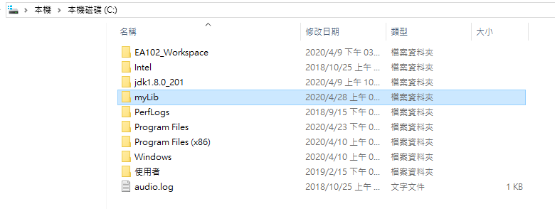
  </div>

- 開啟引入介面

  <div style="text-align:center">
    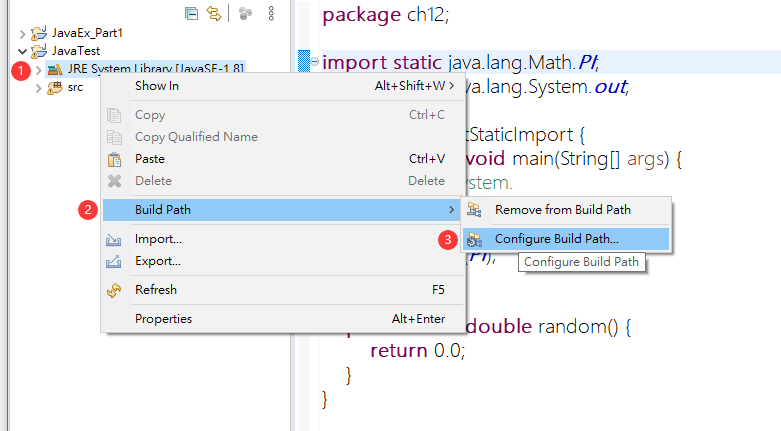
  </div>

- 選擇要引入的函式庫

  <div style="text-align:center">
    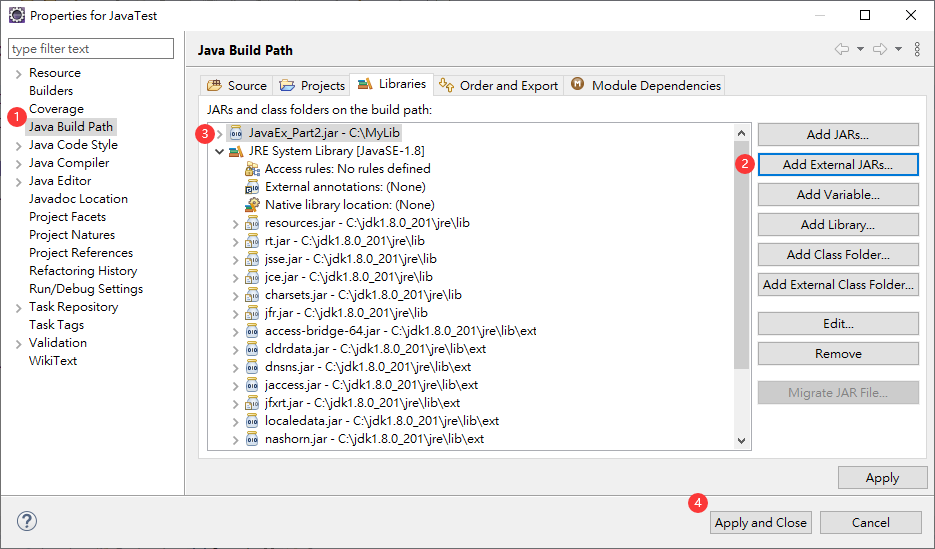
  </div>

- 成功引入

  <div style="text-align:center">
    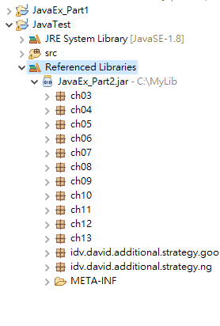
  </div>

# Eclipse 移除引入的類別函式庫

- `Build Path` > `Configure Build Path...`

  <div style="text-align:center">
    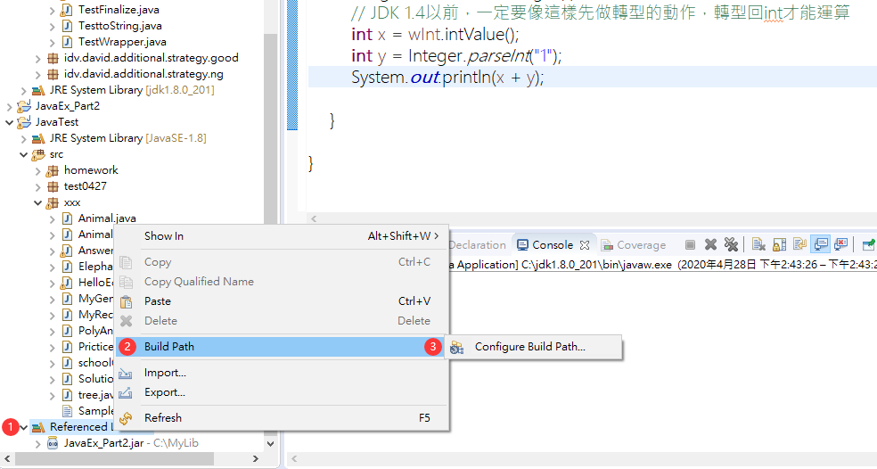
  </div>

- 選擇需移除的函式庫 > `Remove` > 移除成功

  <div style="text-align:center">
    
  </div>

# 注意

- JDK 的位元(32 位)，需和 Eclipse 相同否則會報錯

---

參考鏈接:

- [Eclipse 修改所有文件預設編碼為 UTF-8](https://blog.csdn.net/qq_24879495/article/details/78028180)
- [Eclipse 導入壓縮項目](https://wiki.scn.sap.com/wiki/display/BOBJ/Importing+Java+source+code+into+Eclipse)
- [Eclipse 出現大紅感歎號問題](https://blog.csdn.net/DuanLiuchang/article/details/78816847)
- [Eclipse 中斷點測試](https://ocean2002n.pixnet.net/blog/post/80860099)
- [Eclipse 保存代码时自动格式化](https://blog.csdn.net/shenhaiwen/article/details/71629581)
- [Eclipse 導入項目提示已存在（Some projects cannot be imported because they already exist in the workspace)](https://blog.csdn.net/slk_qing/article/details/77864559)
