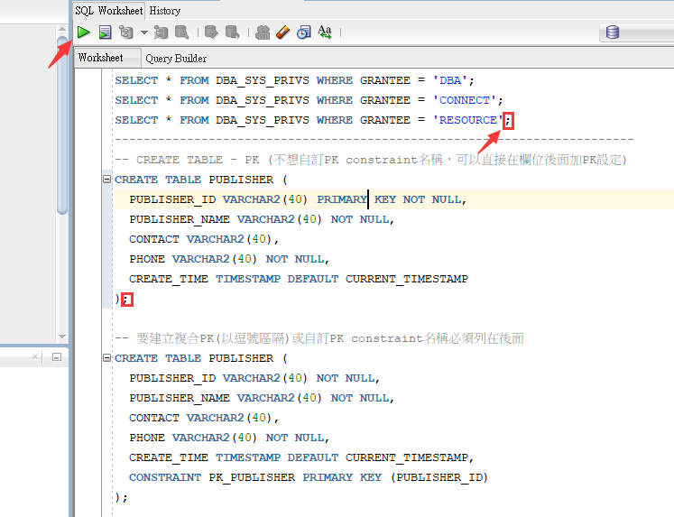
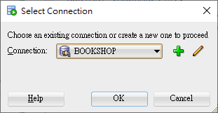
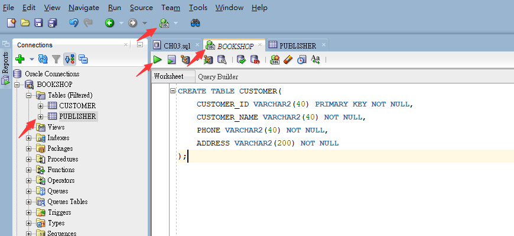
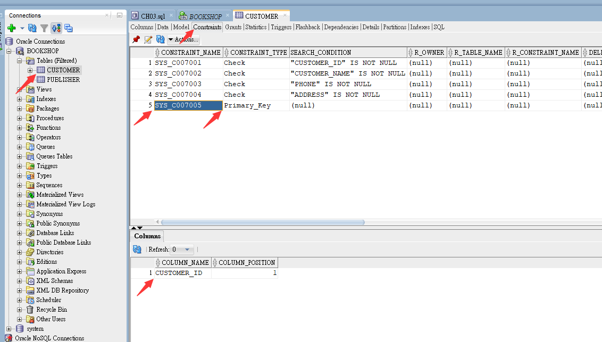

<h1 id="top">目錄</h1>

- [1. 設計流程](#s1)
- [2. 常用資料類型](#s2)
- [3. 指令法建立表格](#s3)
- [4. 表格創建](#s4)
- [5. 查看創建結果](#s5)
- [6. 查看表格](#s6)
- [7. 創建並加上檢查效果](#s7)
- [8. 建立外來鍵](#s8)

---

# <a id="s1" class="md-title" href="#top">1. 設計流程</a>

- 制定欄位

  - 蒐集資料

    - 查閱紙本表單或紀錄

    - 與相關人員訪談

    - 觀摩實際狀況

- 正規化

  - 以資料結構的角度分析欄位的歸屬與表格的關聯

  - 減少重複過冗，增進資料的一致性

# <a id="s2" class="md-title" href="#top">2. 常用資料類型</a>

- 數字
- 文字
  - VARCHAR
    - 沒固定長度時用此資料類型建立
    - 1~4000 字元
- 日期時間
- 大型物件

# <a id="s3" class="md-title" href="#top">3. 指令法建立表格</a>

- 滑鼠點擊過的地方，Oracle 會自動抓取上個結束點到下個結束點範圍的程式碼去執行

  <div style="text-align:center">
    
  </div>

- 選擇連線的資料庫 (確定在哪邊創建此表單，有相同名稱的表格不可重複建立)

  <div style="text-align:center">
    
  </div>

# <a id="s4" class="md-title" href="#top">4. 表格創建</a>

- `SQL` > `將指令寫在文件中`

- 輸入 Oracle<sup class="footnote-ref"><a href="#fn1" id="fnref1">[1]</a></sup>指令<sup class="footnote-ref"><a href="#fn2" id="fnref2">[2]</a></sup>

  ```sql
  CREATE TABLE CUSTOMER(
    CUSTOMER_ID VARCHAR2(40) PRIMARY KEY NOT NULL,
    CUSTOMER_NAME VARCHAR2(40) NOT NULL,
    PHONE VARCHAR2(40) NOT NULL,
    ADDRESS VARCHAR2(200) NOT NULL
  );
  ```

- `Start` > `建立完成`

  <div style="text-align:center">
    
  </div>

- 建立完成結果

  ```cs
  Table CUSTOMER created.
  ```

# <a id="s5" class="md-title" href="#top">5. 查看創建結果</a>

- 點擊指定表格 > Constraints

  <div style="text-align:center">
    
  </div>

# <a id="s6" class="md-title" href="#top">6. 查看表格</a>

- 使用 `DESCRIBE 表單名稱`

  ```SQL
  DESCRIBE PUBLISH
  ```

  ***

  ```cs
  Name          Null?    Type
  ------------- -------- -------------
  CUSTOMER_ID   NOT NULL VARCHAR2(40)
  CUSTOMER_NAME NOT NULL VARCHAR2(40)
  PHONE         NOT NULL VARCHAR2(40)
  ADDRESS       NOT NULL VARCHAR2(200)
  ```

# <a id="s7" class="md-title" href="#top">7. 創建並加上檢查效果</a>

- <table>
  <thead>
  <tr>
  <th style="text-align:center">鍵名</th>
  <th style="text-align:center">資料型別</th>
  <th style="text-align:center">Constrains</th>
  </tr>
  </thead>
  <tbody>
  <tr>
  <td style="text-align:center">PRICE</td>
  <td style="text-align:center">NUMBER(8,2)</td>
  <td style="text-align:center">CHECK (PRICE &gt;= 0)</td>
  </tr>
  </tbody>
  </table>

# <a id="s8" class="md-title" href="#top">8. 建立外來鍵</a>

- KEY 名(PUBLISHER_ID)可不相同，但資料類型與資料大小需相同

  ```sql
  FOREIGN KEY (鍵名) REFERENCES 表名(鍵名)
  ```

---

<section class="footnotes">
<ol class="footnotes-list">
<li id="fn1" class="footnote-item"><p>程式語言(指具有流程控制的語言) ; Sql 本身不算程式語言，但 Oracle 有新增 PLC <a href="#fnref1" class="footnote-backref">↩︎</a></p>
</li>
<li id="fn2" class="footnote-item"><p>Oracle 入值區別大小寫，其他不區分大小寫 <a href="#fnref2" class="footnote-backref">↩︎</a></p>
</li>
</ol>
</section>

---

參考鏈接

- [oracle 流程控制](https://www.itread01.com/content/1541222404.html)
- [oracle char 与 varchar2 的比较与使用](https://blog.csdn.net/IndexMan/article/details/7758909)
- [oracle 的資料型別及 number 型別詳解](https://www.itread01.com/content/1548889930.html)
